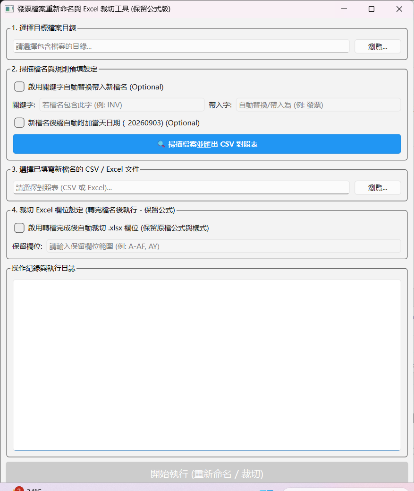
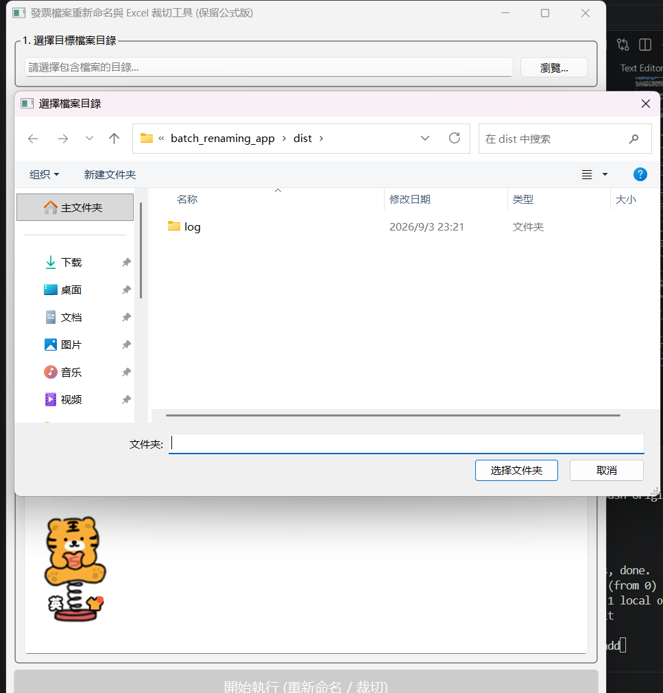
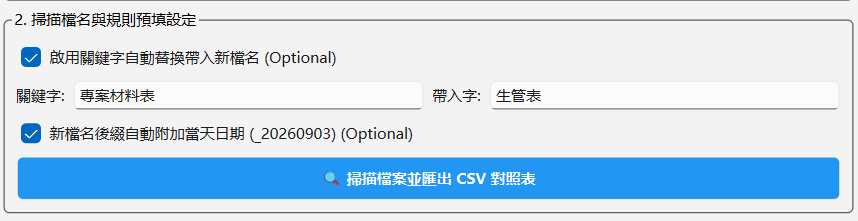
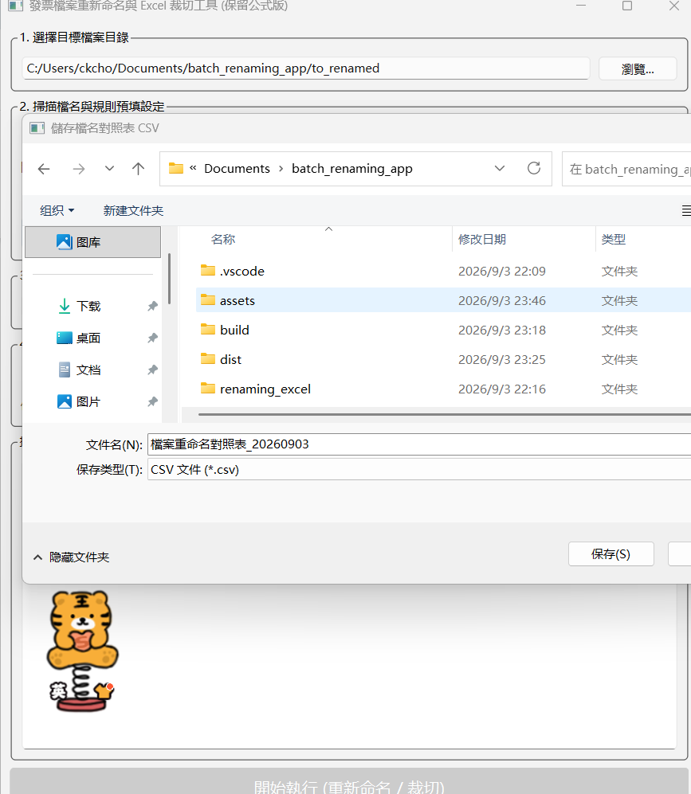
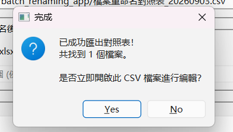
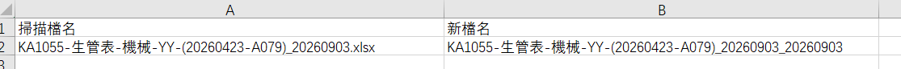
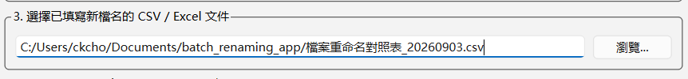

# 發票檔案重新命名與 Excel 裁切工具 (Invoice File Renamer & Excel Cropper)

這是一個基於 Python 與 PyQt6 開發的桌面應用程式，旨在透過 CSV/Excel 表單自動化批次重新命名檔案（如發票、收據或掃描文件），並支援在轉檔後自動進行 **Excel 欄位裁切（原生保留公式與樣式）**。

---

## 🌟 最新版本重點更新

1. **自動掃描與預填對照表**：可一鍵掃描目錄下所有檔案並自動匯出 CSV 對照表，支援「關鍵字替換」與「自動附加當天日期」功能。
2. **Excel 原生欄位裁切 (保留公式版)**：改以 `openpyxl` 進行原生刪除操作，裁切指定欄位時能**完整保留原檔公式、計算關係與格式樣式**。

---

## 主要功能

* **自動化掃描與匯出**：自動讀取目標資料夾檔案，彈性設定關鍵字替換規則與日期後綴，並產出 CSV 對照表。
* **批次重新命名**：支援 CSV 與 Excel (.xlsx/.xls) 格式對照表，一次處理成百上千個檔案。
* **欄位裁切與公式保護**：可自動刪除未指定的欄位（如輸入 `A-AF, AY` 保留特定範圍），採用從右至左的刪除機制，確保公式參照不移位。
* **防錯機制**：
* 自動檢查目錄與檔案是否存在。
* 防止目標檔名重複覆蓋。
* 完整紀錄詳細執行日誌。


---

## 安裝需求

在使用此工具前，請確保您的環境已安裝 **Python 3.8+** 以及相關依賴套件：

```bash
pip install PyQt6 pandas openpyxl

```

## Application View


---

## 使用步驟與說明

```
+-----------------------------------------------------------------------+
|  1. 選擇目標檔案目錄 (Select Directory)                                 |
+---------------------------------------------

--------------------------+

                                  │
                                  ▼
+-----------------------------------------------------------------------+
|  2. 掃描檔名與規則預填設定 (Scan & Export CSV - Optional)               |
|     - 設定關鍵字自動替換                                              |
|     - 自動附加當天日期後綴 (例: _20260903)                            |
+-----------------------------------------------------------------------+
                                  │
                                  ▼
+-----------------------------------------------------------------------+
|  3. 選擇已填寫新檔名的 CSV / Excel 文件 (Select Mapping File)           |
+-----------------------------------------------------------------------+
                                  │
                                  ▼
+-----------------------------------------------------------------------+
|  4. 裁切 Excel 欄位設定 (Crop Excel Columns - Optional)                 |
|     - 保留指定欄位 (例: A-AF, AY)，其餘自動刪除並保留公式             |
+-----------------------------------------------------------------------+
                                  │
                                  ▼
+-----------------------------------------------------------------------+
|  5. 按下「開始執行」按鈕                                               |
+-----------------------------------------------------------------------+

```

### 第一步：選擇目標檔案目錄

點擊「瀏覽...」選擇存放原始掃描檔（PDF、影像或 Excel 檔）的資料夾。



選擇需要重新命名的folder.

---

### 第二步：自動掃描與預填規則（可選）

1. **關鍵字替換**：勾選後可設定關鍵字（如 `INV`）與替換字（如 `發票`）。
2. **日期後綴**：勾選後會自動在建議檔名後方加上當天日期（如 `_20260903`）。



3. 按下 **「🔍 掃描檔案並匯出 CSV 對照表」**，系統將自動產生 CSV 檔並可直接開啟編輯。




確認轉檔正確即可開始進行第三步.

---

### 第三步：選擇對照表文件

選擇填寫完畢的檔名對照表（CSV 或 Excel 檔案）。

#### 對照表欄位規範：

對照表必須包含以下兩個關鍵欄位名稱：

| 掃描檔名 | 新檔名 |
| --- | --- |
| SCAN001.pdf | 20260903_台電電費單 |
| SCAN002.pdf | 20260903_自來水費 |

> **注意**：若「新檔名」未輸入副檔名，程式會自動沿用「掃描檔名」原有的副檔名。

---

### 第四步：裁切 Excel 欄位設定（可選）

勾選 **「啟用轉檔完成後自動裁切 .xlsx 欄位」**，並輸入欲**保留**的欄位範圍（例：`A-AF, AY`）。

> **說明**：重新命名完成後，程式會自動掃描資料夾內所有的 `.xlsx` 檔案，將未在保留範圍內的欄位安全刪除，且不會破壞原本的公式與視覺格式。

---

### 第五步：開始執行

確認設定無誤後，點擊 **「開始執行 (重新命名 / 裁切)」**。完成後會彈出視窗顯示成功與失敗件數，並於下方日誌區顯示細節。

---

## 技術堆疊

* **GUI 框架**：PyQt6
* **資料處理**：Pandas
* **Excel 操作與公式保護**：OpenPyXL
* **檔案系統**：Python `os` / `datetime` 模組

---

## 打包成 Windows 執行檔 (.exe)

使用 **PyInstaller** 即可將程式與相關依賴套件打包成單一可執行檔：

### 1. 安裝 PyInstaller

```bash
pip install pyinstaller

```

### 2. 執行打包指令

```bash
pyinstaller --noconsole --onefile --name "發票重新命名與裁切工具" main.py

```

* `--noconsole`：隱藏背景命令提示字元視窗（適合 GUI 應用程式）。
* `--onefile`：打包為單一 `.exe` 檔案。
* `--name`：設定產出的執行檔名稱。

### 3. 加上自訂圖示 (Icon)

若有 `.ico` 格式圖示檔，可加入 `--icon` 參數：

```bash
pyinstaller --noconsole --onefile --icon=app_icon.ico --name "發票重新命名與裁切工具" main.py

```

打包完成後，可於生成的 `dist/` 資料夾中取得 `.exe` 檔。

---